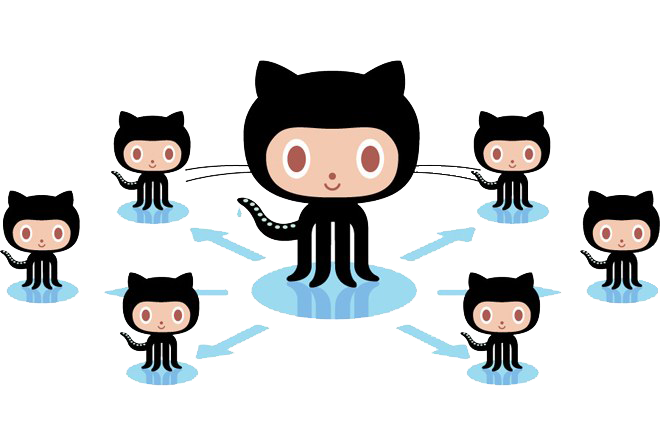

  

# GitHub Actions Runner

The runner is the application that runs a job from a GitHub Actions workflow. It is used by GitHub Actions in the [hosted virtual environments](https://github.com/actions/virtual-environments), or you can [self-host the runner](https://help.github.com/en/actions/automating-your-workflow-with-github-actions/about-self-hosted-runners) in your own environment.

## Get Started

For more information about installing and using self-hosted runners, see [Adding self-hosted runners](https://help.github.com/en/actions/automating-your-workflow-with-github-actions/adding-self-hosted-runners) and [Using self-hosted runners in a workflow](https://help.github.com/en/actions/automating-your-workflow-with-github-actions/using-self-hosted-runners-in-a-workflow)

Runner releases:

 [Pre-reqs](docs/start/envwin.md) | [Download](https://github.com/actions/runner/releases)  

  [Pre-reqs](docs/start/envosx.md) | [Download](https://github.com/actions/runner/releases)  

  [Pre-reqs](docs/start/envlinux.md) | [Download](https://github.com/actions/runner/releases)

## Contribute

We accept contributions in the form of issues and pull requests.  [Read more here](docs/contribute.md) before contributing.
