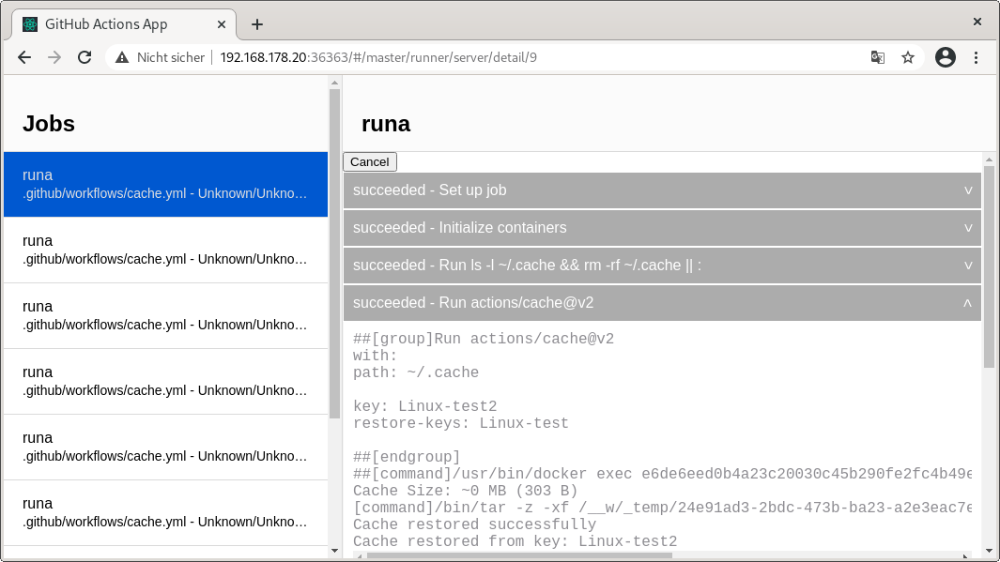

# Local GitHub Actions and Azure Pipelines Emulator

[](https://github.com/ChristopherHX/runner.server/actions/workflows/build.yml)

This fork of [actions/runner](https://github.com/actions/runner) adds two executables to this Project, `Runner.Server` as a runner backend like github actions and `Runner.Client` to schedule workflows via commandline.

<p align="center">
  
</p>

## Usage
- [Download the Actions Runner Client + Server](https://github.com/ChristopherHX/runner/releases/latest)
- The installation directory needs to be accessible by docker file sharing
  - On Linux (Docker) all non overlayfs folders should work
  - On macOS (Docker Desktop) you might need to add the install path to Docker File Sharing
  - On Windows (Docker Desktop) you might need to accept all file sharing requests (hyper-v backend)
  - Docker Settings -> Resources -> File Sharing
  - [Tracking issue for macOS](https://github.com/ChristopherHX/runner.server/issues/72)
- Clone your github actions repo
- Run `Runner.Client`(`.exe`) (It is inside the bin folder of the package) inside your checkout

## Dotnet Tool (Runner.Client)
The current nuget package [can be found here](https://www.nuget.org/packages/Runner.Client)
- Install the [dotnet sdk 6.0.0 or newer](https://dotnet.microsoft.com/en-us/download/dotnet)
- Install `dotnet tool install --global Runner.Client`
- Already Installed? Update `dotnet tool update --global Runner.Client`

### Dotnet Tool (gharun)
The legacy nuget package [can be found here](https://www.nuget.org/packages/io.github.christopherhx.gharun)
- Install the [dotnet sdk 6.0.0 or newer](https://dotnet.microsoft.com/en-us/download/dotnet)
  - dotnet sdk 6.0.100 and 6.0.x are known to work and tested via CI
- `dotnet tool install --global io.github.christopherhx.gharun`
- Run `gharun` like `Runner.Client`

### Azure Pipelines
This is experimental and covers a subset of Azure Pipelines.

[Quickstart Guide](./docs/quick-start/azure-pipeline.md)

[Azure Pipelines Tools VSCode Extension](./src/azure-pipelines-vscode-ext/README.md)

[ExpandAzurePipelines Online Playground](https://christopherhx.github.io/runner.server/ExpandAzurePipelines)

run `Runner.Client --event azpipelines -W pipeline.yml` / `gharun --event azpipelines -W pipeline.yml` to run Azure Pipelines locally, _this tool defaults to GitHub Actions and looks by default in `.github/workflows/` for yaml files_.
#### Templating
```yaml
steps:
  - ${{ each x in split('hello, world, x, y', ', ') }}:
      - script: |
          echo ${{ x }}
      - ${{ if in(x, 'x', 'y') }}:
          - script: |
              echo "This step is injected if x is 'x' or 'y'"
      - ${{ else }}:
          - script: |
              echo "This step is injected if x isn't 'x' or 'y'"
```

## Environment Secret files
CLI
```
Runner.Client -W sample.yml --environment-secret-file develop=develop.yml --environment-secret-file staging=staging.yaml --environment-secret-file prod=prod.secrets
```

develop.yml, staging.yaml
```yaml
secret1: |
  My multiline secret
  it's yaml
secret2: val3
```

prod.secrets
```
secret1<<DELIMITER
My multiline secret
it's the environment file syntax of github actions
see GITHUB_ENV
DELIMITER
secret2=val3 x
prodsecret=xval
```

sample.yml
```yaml
on: push
jobs:
  test:
    strategy:
      matrix:
        environment:
        - develop
        - staging
        - prod
    runs-on: self-hosted
    environment: ${{matrix.environment}}
    steps:
    - run: echo prodsecret=${{env.prodsecret}}
      if: env.prodsecret
      env: ${{secrets}}
    - run: exit ${{ secrets.secret1 && secrets.secret2 && (matrix.environment != 'prod' || secrets.prodsecret) && '0' || '1' }}
```

## Troubleshooting

If you get an error like: 
```
Error: No runner is registered for the requested runs-on labels: [ubuntu-latest], please register and run a self-hosted runner with at least these labels...
```

Then you will need to add one of the following cli options, replace `ubuntu-latest` with the content between `runs-on labels: [` The labels here without spaces `]`
- to run it on your local machine e.g. `-P ubuntu-latest=-self-hosted`, `-P self-hosted,linux,mylabel=-self-hosted`
- to run it in a docker container e.g. `-P ubuntu-latest=catthehacker/ubuntu:act-latest`, `-P self-hosted,linux,mylabel=catthehacker/ubuntu:act-latest`
  For more docker images refer to https://github.com/nektos/act#runners

This Software reads [act configuration files](https://github.com/nektos/act#configuration), you can save this inside a `.actrc` in your current or home folder to avoid typing it in your commandline.

## Building

```
dotnet msbuild src/dir.proj -t:GenerateConstant
dotnet build src/Runner.Client
```

This builds `Runner.Client`, `Runner.Server` and a modifed github actions runner `Runner.Listener`.

### Building a framework dependent and os independent executable
```
dotnet msbuild src/dir.proj -t:GenerateConstant
dotnet publish src/Runner.Client -c Release --no-self-contained -p:BUILD_OS=Any -p:RuntimeFrameworkVersion=6.0.0
```

#### To run the package on a different Operating System
```
dotnet Runner.Client.dll
```
```
dotnet Runner.Server.dll
```
```
dotnet Runner.Listener.dll
```
### Building a self-contained executable
Replace `win-x64` with any supported platform of .net5: https://docs.microsoft.com/en-us/dotnet/core/rid-catalog.
```
dotnet msbuild src/dir.proj -t:GenerateConstant
dotnet publish src/Runner.Client -c Release -r win-x64
```
#### To run the package
```
./Runner.Client
```
```
./Runner.Server
```
```
./Runner.Listener
```

### Building a dotnet tool
```
dotnet msbuild src/dir.proj -t:GenerateConstant
dotnet pack src/Runner.Client -c Release -p:BUILD_OS=Any -p:RuntimeFrameworkVersion=6.0.0
```
#### To install the package
```
dotnet tool install -g Runner.Client --add-source src/Runner.Client/nupkg
```
#### To run the package
```
Runner.Client
```

## Advanced Usage

You may need to allow non root processes to bind port 80 on Linux https://superuser.com/questions/710253/allow-non-root-process-to-bind-to-port-80-and-443 otherwise you cannot register official runners. If you configure the runner of this project any port is fine, e.g. port 5000 will work too.
```
./bin/Runner.Server --urls http://localhost
```

### Setup a runner
You can type anything you want for registration and removal token authentication isn't implemented yet.

Linux or macOS:
```
./config.sh --unattended --url http://localhost/runner/server --token "ThisIsIgnored"
```

Windows:
```
.\config.cmd --unattended --url http://localhost/runner/server --token "ThisIsIgnored"
```

Connect a runner

Linux or macOS:
```
./run.sh
```

Windows:
```
.\run.cmd
```

### Schedule one or more job's
You will have to remove any leading `/` from your server url.

Linux or macOS:
```
./bin/Runner.Client --workflow workflow.yml --event push --payload payload.json --server http://localhost
```

Windows
```
.\bin\Runner.Client.exe --workflow workflow.yml --event push --payload payload.json --server http://localhost
```

Or send github / gitea webhooks to http://localhost/runner/server/_apis/v1/Message.

Open http://localhost to see the progress.

### Sample appsettings.json for [try.gitea.io](http://try.gitea.io/)

```json
{
  "AllowedHosts": "*",
  "Runner.Server": {
    "ServerUrl": "https://actions-service.azurewebsites.net",
    "GitServerUrl": "https://try.gitea.io",
    "GitApiServerUrl": "https://try.gitea.io/api/v1",
    "GitGraphQlServerUrl": null,
    "GITHUB_TOKEN": "",
    "ActionDownloadUrls": [
      {
        "TarballUrl": "https://try.gitea.io/{0}/archive/{1}.tar.gz",
        "ZipballUrl": "https://try.gitea.io/{0}/archive/{1}.zip"
      }
    ]
  }
}
```

### Secure the runner registration endpoint
With this config you are no longer allowed to register a runner with any token, you need to specify `--token youNeedToEnterThisTokenToRegisterAnRunner` during configure
```json
{
  "Runner.Server": {
    "RUNNER_TOKEN": "youNeedToEnterThisTokenToRegisterAnRunner"
  }
}
```

### Allow PullRequest events
Process the `pull_request` action trigger, if disabled only `pull_request_target` from the target branch or `pull_request` from the same repository are processed. Enabling this make it possible to leak secrets and run arbitary code on your self-hosted runners from forked repositories. Proper secret and self-hosted runner protection needs to be implemented, to make this safe to enable.
```json
{
  "Runner.Server": {
    "AllowPullRequests": true
  }
}
```

### Secure Webhook endpoint with a shared secret
Add `youNeedToEnterThisTokenToAuthorizeWebhooks` as a secret in the configuration page.

#### For Gitea this should work
```json
{
  "Runner.Server": {
    "WebhookHMACAlgorithmName": "HMACSHA256",
    "WebhookSignatureHeader": "X-Gitea-Signature",
    "WebhookSecret": "youNeedToEnterThisTokenToAuthorizeWebhooks"
  }
}
```
#### For GitHub this should work
```json
{
  "Runner.Server": {
    "WebhookHMACAlgorithmName": "HMACSHA256",
    "WebhookSignatureHeader": "X-Hub-Signature-256",
    "WebhookSignaturePrefix": "sha256=",
    "WebhookSecret": "youNeedToEnterThisTokenToAuthorizeWebhooks"
  }
}
```

### Change the public url of the Server
If this doesn't match with the your configuration url, you cannot configure any runner.
```json
{
  "Runner.Server": {
    "ServerUrl": "https://actions-service.azurewebsites.net",
  }
}
```

### Configure insecure Secrets or feature toggles on the Server
```json
{
  "Runner.Server": {
    "Secrets": [
      {"Name": "mysecret1", "Value": "test"},
      {"Name": "myothersecret", "Value": "other"}
    ]
  }
}
```

### Configure insecure Environment Secrets

This provides the secrets `mysecret1`, `myothersecret` to jobs with the `environment` name set to `develop`. Only the `Runner.Server:GITHUB_TOKEN`, `Runner.Server:GITHUB_TOKEN_READ_ONLY` and `Runner.Server:GITHUB_TOKEN_NONE` properties are shared with jobs with a specfic environment.
`appsettings.json`
```json
{
  "Runner.Server": {
    "Environments": {
      "develop": {
        "mysecret1": "test",
        "myothersecret": "other"
      }
    }
  }
}
```
CLI
```
Runner.Server --Runner.Server:Environments:develop:mysecret1=test --Runner.Server:Environments:develop:myothersecret=other
```

### Configure to use sqlite instead of an in Memory DB
```json
{
  "ConnectionStrings": {
    "sqlite": "Data Source=Agents.db;"
  }
}
```

### OpenId Connect for gitea
Currently only requires login if configured.
You will need a pem certificate pair or choose another aspnetcore https configuration
- cert.pem: only a single certificate will work, no cert chain
- key.pem

Add `<url of Runner.Server>/signin-oidc` (https://localhost:5001/signin-oidc) as redirect url for the OAuth app in gitea.
```json
{
  "Kestrel": {
    "Endpoints": {
      "HttpsFromPem": {
        "Url": "https://*:5001",
        "Certificate": {
          "Path": "./cert.pem",
          "KeyPath": "./key.pem"
        }
      }
    }
  },
  "ClientId": "ClientId of your Oauth app",
  "ClientSecret": "Client secret of your Oauth app",
  "Authority": "https://try.gitea.io",
}
```

### OpenId Auth AWS
**Requires** v3.11.14 or later

What you will need
- domain with a pem certificate pair
- free 443 port on the domain
- port forward 443 of the domain to your device e.g. 5001 (can be changed)

```
env "RUNNER_SERVER_Runner.Server__ServerUrl=https://<mydomain>" RUNNER_SERVER_Kestrel__Endpoints__HttpsFromPem__Url=https://*:5001 RUNNER_SERVER_Kestrel__Endpoints__HttpsFromPem__Certificate__Path=$PWD/cert.pem RUNNER_SERVER_Kestrel__Endpoints__HttpsFromPem__Certificate__KeyPath=$PWD/privkey.pem gharun --interactive
```

- Open AWS Console
- Select iam
- Select Idendity Provider
- Create One
- Select OpenId Connect
- Enter your domain **without leading /, otherwise the aws action would fail abnormally**
- Enter the audience field of the aws action as client id (e.g. sts.amazonaws.com)
- Press Assign Role
- Press Create Role
- Change trust Policy like you want
- copy the aws arn id from the previously created role

Now test it locally
```yaml
    - name: Configure AWS Credentials
      uses: aws-actions/configure-aws-credentials@v4
      id: myaws-id
      with:
        aws-region: us-east-1         # Change to your aws region
        role-to-assume: <role arn id> # Open the role detail page and copy the arn number
        audience: sts.amazonaws.com   # Adjust as needed
```

VSCode port forwarding is not usable for aws trust

### Dynamic GITHUB_TOKEN with specified permissions ( GitHub App )

Create a new github app with the following permissions
- Read access to metadata
- Read and write access to actions, checks, code, commit statuses, deployments, discussions, issues, packages, pull requests, repository projects, and security events

Create the private key and configure the server to use the private key and your GitHubAppId.
```json
{
  "Runner.Server": {
    "GitHubAppPrivateKeyFile": "path/to/privatekey.pem",
    "GitHubAppId": 32344
  }
}
```
CLI
```
Runner.Server --Runner.Server:GitHubAppPrivateKeyFile=path/to/privatekey.pem --Runner.Server:GitHubAppId=32344
```

#### AllowPrivateActionAccess
You can allow that your workflows can access private reusable workflows and actions where your GitHub App is registered. **Do not use together with AllowPullRequests or the content of all your private repositories can be leaked.**

```json
{
  "Runner.Server": {
    "AllowPrivateActionAccess": true
  }
}
```

### OnQueueJob
You can configure the server to execute a command once a job is queued, e.g. you can configure or start a suspended runner to run the job.

For example run a bash script, you can see the stdout and stderr of the process in the live logs of the job which ran the hook
```json
{
  "Runner.Server": {
    "OnQueueJobProgram": "/bin/bash",
    "OnQueueJobArgs": "\"/home/ubuntu/runner.server-3.6.0/upscale.sh\""
  }
}
```
You also get the `RUNNER_SERVER_PAYLOAD` environment variable with information about the queued job. Sample Content:
```json
{
    "contextData": {
        "inputs": null,
        "github": {
            "server_url": "https://github.com",
            "api_url": "https://api.github.com",
            "graphql_url": "https://api.github.com/graphql",
            "workflow": "example",
            "repository": "murx/murx",
            "sha": "02303847892393472939380472973932",
            "repository_owner": "murx",
            "ref": "refs/tags/urgh",
            "ref_protected": false,
            "ref_type": "tag",
            "ref_name": "urgh",
            "head_ref": "",
            "base_ref": "",
            "event": {
                "commits": [
                    {
                        "message": "Untraced changes",
                        "id": "02303847892393472939380472973932",
                        "added": [],
                        "removed": [],
                        "modified": []
                    }
                ],
                "sender": {
                    "login": "weird",
                    "name": "weird",
                    "email": "weird@runner.server.localhost",
                    "id": 976638,
                    "type": "user"
                },
                "pusher": {
                    "login": "weird",
                    "name": "weird",
                    "email": "weird@runner.server.localhost",
                    "id": 976638,
                    "type": "user"
                },
                "before": "0000000000000000000000000000000000000000",
                "ref": "refs/tags/urgh",
                "after": "02303847892393472939380472973932",
                "head_commit": {
                    "message": "Untraced changes",
                    "id": "02303847892393472939380472973932",
                    "added": [],
                    "removed": [],
                    "modified": []
                },
                "repository": {
                    "owner": {
                        "login": "weird",
                        "name": "weird",
                        "email": "weird@runner.server.localhost",
                        "id": 976638,
                        "type": "user"
                    },
                    "default_branch": "main",
                    "master_branch": "master",
                    "name": "murx",
                    "full_name": "murx/murx"
                }
            },
            "event_name": "push",
            "actor": "weird",
            "run_id": "824",
            "run_number": "824",
            "retention_days": "90",
            "run_attempt": "1",
            "repositoryUrl": "https://github.com/murx/murx.git"
        },
        "needs": {},
        "strategy": {
            "fail-fast": true,
            "max-parallel": 1,
            "job-total": 1,
            "job-index": 0
        },
        "matrix": null
    },
    "repository": "murx/murx",
    "workflowFileName": ".github/workflows/main.yaml",
    "job": "test",
    "jobDisplayName": "test",
    "environment": "",
    "labels": [
        "self-hosted",
        "container-host"
    ]
}
```

### The `.actrc` File
Put every parameter pair into a single line, here just a sample
```
-e event.json
--env-file myenvs
--secret-file mysecrets
-P self-hosted,linux=-self-hosted
-P ubuntu-latest=catthehacker/ubuntu:act-latest
-P ubuntu-20.04=node:12.20.1-buster-slim
-P ubuntu-18.04=node:12.20.1-buster-slim
-P ubuntu-16.04=node:12.20.1-stretch-slim
```

### The env-file and secret-file
This multiline syntax doesn't work with nektos/act and vice versa.
```
name=value
multilinename<<EOF
First line
Second line
EOF
othername=value2
othername2=value3
```

### Use as an actions artifact and cache server

You can disable the authentication layer, then you can point the artifact / cache api to this server.

```
Runner.Server --Runner.Server:byPassAuth=true --urls "http://*:4555"
```

You can now point act or nodejs to this server, then you can use the actions artifact and cache apis locally.

```
act -W cache.yml --env ACTIONS_CACHE_URL=http://host.docker.internal:4555/
```

### Dev
```
dotnet build ./src/Runner.Server/ /p:EFMigration=ON
dotnet ef migrations add --project ./src/Runner.Server/ --no-build PersistentJobs
dotnet pack src/Runner.Client -c Release -p:BUILD_OS=Any -p:RuntimeFrameworkVersion=6.0.0 -p:Version=3.4.0.3
dotnet tool install -g Runner.Client --add-source src/Runner.Client/nupkg
dotnet tool update -g Runner.Client --add-source src/Runner.Client/nupkg
```

## Notes
This Software contains Open Source reimplementations of some parts of the proprietary github action service.

- manage runners
- job parsing and scheduling to runners
- matrix parsing and evaluation
- callable workflows
- `on` parsing incl. filter
- context creation of `github`, `needs`, `matrix`, `strategy` and `inputs`
- job inputs / outputs, based on documentation
- secret management
- cache service
- artifact service

The following things will behave exactly like the original

- expression evaluation
- step evaluation on the runner incl. container actions

## Something not working?
Please open an issue at this fork, to get it fixed.