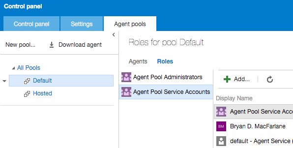

# VSTS Cross Platform Agent (CoreCLR)

## Overview

A cross platform build and release agent for Visual Studio Team Services and Team Foundation Server 2015 and beyond.  This will be replacing/combining the existing closed source windows build agent and the existing [xplat agent](https://github.com/Microsoft/vso-agent)

Supported on Windows, OSX and Linux.  Written for the .NET Core CLR as one code base in C#.

Will run all existing tasks (typescript/javascript and powershell) including [our in the box](https://github.com/Microsoft/vso-agent-tasks) and your custom tasks written with our [vsts task SDK](https://github.com/Microsoft/vsts-task-lib). 

## Status

A preview is available for Ubuntu and OSX for VSTS.  The current preview is more feature complete than the node agent bringing Auto Update, Cancellation, Run as a svc on OSX and Linux, and Gated support.

What's missing from the preview? On-prem NTLM support is in the works so preview with VSTS.  Windows preview coming soon.

|   | Build & Test | Preview | Release |
|---|:-----:|:-----:|:-----:|
| **Ubuntu 14.04**|| [v2.99.0](https://github.com/Microsoft/vsts-agent/releases/tag/v2.99.0) | Soon |
| **OSX 10.11**|| [v2.99.0](https://github.com/Microsoft/vsts-agent/releases/tag/v2.99.0) | Soon
| **Windows 10**|| Soon | |

## Configure Account

VSTS only for now.  On-prem coming with NTLM support in the works.

Create a PAT token.  [Step by Step here](http://roadtoalm.com/2015/07/22/using-personal-access-tokens-to-access-visual-studio-online/)

Add the user you created the PAT token for to *both*:

  1. Agent Pool Administrators (allows to register)
  2. Agent Pool Service Accounts (allows listening to build queue)

>> TIPS:
>> You can add to roles for a specific pool or select "All Pools" on the left and grant for all pools.  This allows the account owner to delegate build administration globally or for specific pools.  [More here](https://msdn.microsoft.com/en-us/Library/vs/alm/Build/agents/admin)
>> The PAT token is only used to listen to the message queue for a build job
>> When a build is run, it will generate an OAuth token for the scoped identity selected on the general tab of the build definition.  That token is short lived and will be used to access resource in VSTS

## Get Agent

  [Get Started Ubuntu](docs/startLinux.md)  

  [Get Started OSX](docs/startOSX.md)  

## Configuration

Other detailed configuration options are [covered here](docs/config.md)

## Contribute

For developers that want to contribute, [read here](docs/contribute.md) on how to build and test.
