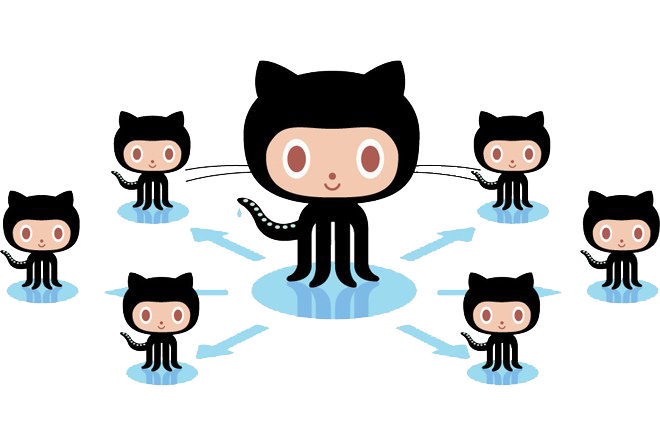

# GitHub Actions Runner + Server

[](https://github.com/ChristopherHX/runner.server/actions/workflows/build.yml)

This fork adds two executables to this Project, `Runner.Server` as a runner backend like github and `Runner.Client` to schedule workflows via commandline from a local `workflow.yml` and a local webhook `payload.json`.

<p align="center">
  
</p>

## Usage
- [Download the Actions Runner Client + Server](https://github.com/ChristopherHX/runner/releases/latest).

- Extract it anywhere you want.

- Clone you github actions repo
- Run `Runner.Client`(`.exe`) (It is inside the bin folder of the package) inside your checkout

## Commandline Options
```
Runner.Client:
  Send events to your runner

Usage:
  Runner.Client [options] [command]

Options:
  --workflow <workflow>                                Workflow to run
  --server <server>                                    Runner.Server address
  -e, --eventpath, --payload <eventpath>               Webhook payload to send to the Runner
  --event <event>                                      Which event to send to a worker [default: push]
  --env <env>                                          env for you workflow, overrides keys from the env file
  --env-file <env-file>                                env overrides for you workflow [default: .env]
  -s, --secret <secret>                                secret for you workflow, overrides keys from the secrets file
  --secret-file <secret-file>                          secrets for you workflow [default: .secrets]
  -j, --job <job>                                      job to run
  -m, --matrix <matrix>                                matrix filter e.g. '-m Key:value', use together with '--job'. Use multiple times to filter more jobs
  -l, --list                                           list jobs for the selected event [default: False]
  -W, --workflows <workflows>                          workflow file or directory which contains workflows, only used if no --workflow option is set [default: .github/workflows]
  -P, --platform <platform>                            Platform mapping to run in a docker image or host
  -a, --actor <actor>                                  The login of the user that initiated the workflow run
  -w, --watch                                          Run automatically on every file change
  -q, --quiet                                          Display no progress in the cli
  --privileged                                         Run docker container under privileged mode
  --userns <userns>                                    Run docker container under a specfic linux user namespace
  --container-architecture <container-architecture>    Run docker container architecture, if docker supports it
  --defaultbranch <defaultbranch>                      The default branch of your workflow run
  -C, --directory <directory>                          change the working directory before running
  -v, --verbose                                        Run automatically on every file change
  --parallel <parallel>                                Run n parallel runners, ignored if --server is used [default: 4]
  --version                                            Show version information
  -?, -h, --help                                       Show help and usage information

Commands:
  schedule
  workflow_dispatch
  repository_dispatch
  check_run
  check_suite
  create
  delete
  deployment
  deployment_status
  fork
  gollum
  issue_comment
  issues
  label
  milestone
  page_build
  project
  project_card
  project_column
  public
  pull_request
  pull_request_review
  pull_request_review_comment
  pull_request_target
  push
  registry_package
  release
  status
  watch
  workflow_run
  startserver                    Starts a server listening on the supplied address or selects a random free http address
  startrunner                    Configures and runs n runner
```

## Troubleshooting

If you get an error like: 
```
Error: No runner is registered for the requested runs-on labels: [ubuntu-latest], please register and run a self-hosted runner with at least these labels...
```

Then you will need add one of the following cli options, replace `ubuntu-latest` with the content between `runs-on labels: [` The labels here without spaces `]`
- to run it on your local machine `-P ubuntu-latest=-self-hosted`
- to run it in a docker container `-P ubuntu-latest=catthehacker/ubuntu:act-latest`
  For more docker images refer to https://github.com/nektos/act#runners

This Sofware reads [act configuration files](https://github.com/nektos/act#configuration), you can save this inside a `.actrc` in your current or home folder to avoid typing it in your commandline.

## Coming from [act](https://github.com/nektos/act)?
This Sofware shares absolutly no source code with `act` and may behave differently.
Just replace `act` with `Runner.Client`(`.exe`) (It is inside the bin folder of the package).
Runner.Server doesn't have all commandline options of act, type `--help` and compare the available commandlineoptions.
Then you will be able to use
- `actions/cache@v2`
- `actions/upload-artifact@v2`
- `actions/download-artifact@v2`
- post run steps
- matrix filter from the cli, `--job test --matrix os:ubuntu-latest`. Repeat `--matrix` to filter more specifically, matches like github actions include.
- exact the same expression interpreter like on github

This implementation is more leightweight than act (Binary size is bigger, due to net5), it is fully compatible with the official github actions self-hosted runner and reuses it's sources.
## Building

```
cd src/
dotnet msbuild ./dir.proj -t:GenerateConstant
cd Runner.Client
dotnet build
```

This builds both `Runner.Client` and `Runner.Server`.

## Advanced Usage

Create a Github Personal Access token (PAT) and replace the GITHUB_TOKEN property in `src\Runner.Server\appsettings.json` and `src\Runner.Server\appsettings.Development.json`.

[Download an unofficial Runner](https://github.com/ChristopherHX/runner/releases/latest).

Using port 5000 prevents offical unmodified runners to connect to the server, because the runner drops the port of the repository during configure. This fork has a patch applied to allow a random port.

Linux or macOS:
```
./bin/Runner.Server
```

Windows
```
.\bin\Runner.Server.exe
```

Open a 2nd Terminal

Setup the unofficial runner, you can type anything for registration and removal token authentication isn't implemented yet.

Linux or macOS:
```
./config.sh --unattended --url http://localhost:5000/runner/server --token "ThisIsIgnored"
```

Windows:
```
.\config.cmd --unattended --url http://localhost:5000/runner/server --token "ThisIsIgnored"
```

Run the official runner

Linux or macOS:
```
./run.sh
```

Windows:
```
.\run.cmd
```

Open a 3rd Terminal

Schedule one or more job's

Linux or macOS:
```
./bin/Runner.Client --workflow workflow.yml --event push --payload payload.json --server http://localhost:5000
```

Windows
```
.\bin\Runner.Client.exe --workflow workflow.yml --event push --payload payload.json --server http://localhost:5000
```

Open http://localhost:5000 to see the progress.

## Notes
This Software contains reimplementations of some parts of the github server which aren't open source (yet?). 

- matrix parsing
- job parsing
- `on` parsing incl. filter
- api server of the open source client
- context creation
- scheduling
- job inputs / outputs, based on documentation

The following things will behave as expected

- expression evaluation
- step evaluation on the runner
- container actions

## Something not working?
Please open an issue at this fork, to get it fixed.

<p align="center">
  
</p>

# GitHub Actions Runner

The runner is the application that runs a job from a GitHub Actions workflow. It is used by GitHub Actions in the [hosted virtual environments](https://github.com/actions/virtual-environments), or you can [self-host the runner](https://help.github.com/en/actions/automating-your-workflow-with-github-actions/about-self-hosted-runners) in your own environment.

## Get Started

For more information about installing and using self-hosted runners, see [Adding self-hosted runners](https://help.github.com/en/actions/automating-your-workflow-with-github-actions/adding-self-hosted-runners) and [Using self-hosted runners in a workflow](https://help.github.com/en/actions/automating-your-workflow-with-github-actions/using-self-hosted-runners-in-a-workflow)

Runner releases:

 [Pre-reqs](docs/start/envwin.md) | [Download](https://github.com/actions/runner/releases)  

  [Pre-reqs](docs/start/envosx.md) | [Download](https://github.com/actions/runner/releases)  

  [Pre-reqs](docs/start/envlinux.md) | [Download](https://github.com/actions/runner/releases)

## Contribute

We accept contributions in the form of issues and pull requests.  [Read more here](docs/contribute.md) before contributing.
