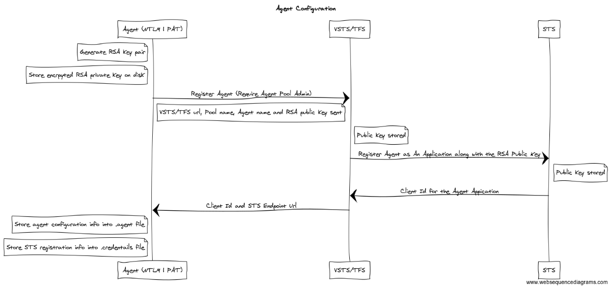
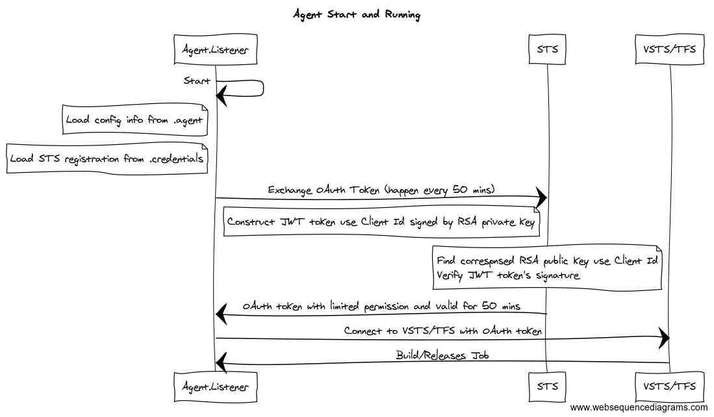
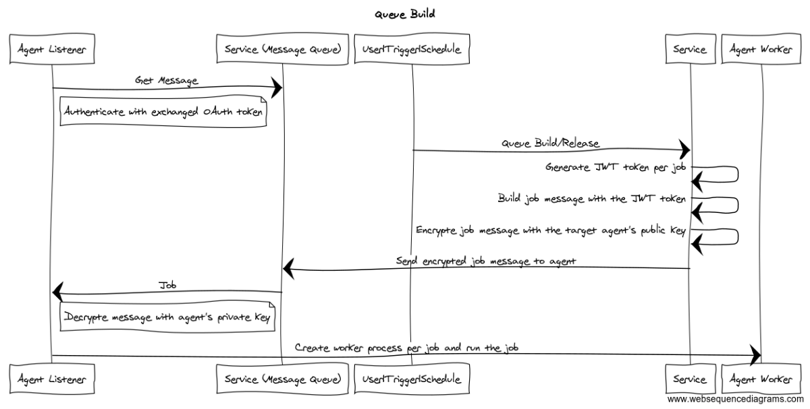

# Runner Authentication and Authorization

## Goals

  - Support runner deployed in un-trusted domains.
  - The account that configures the runner and the account which the runner runs as, is not relevant for accessing Actions resources during a run.
  - Accessing Actions resources is done with a per-run token which expires when the run completes.
  - The token is granted to trusted parts of the system: the runner, installed tasks and script steps specified by the build admin as trusted.  Protect the token from developer contributions such as unit tests, msbuild targets (not designated as trusted by the build admin). 

## Configuration

Configuring an agent registers a runner with a pool using your identity.

Configuration is done with the user being authenticated via a SignedToken/PAT.

*Your credentials are not stored and used later by the agent but are only used for registering the agent with the service.*

During configuration an RSA public/private key pair is created, the private key is stored in file on disk, on windows the content is protected with DPAPI (machine level encryption making the private key read-able only on that machine) and on Linux/OSX with chmod permissions.

Using your credentials, the runner is registered with the service by sending the public key to the Actions service which adds that agent to the pool and stores the public key. Our STS will generate clientId associated with the public key.

## Start and Listen

After configuring the runner, the runner can be started interactively (./run.cmd or ./run.sh) or as a service.

On start the runner listener process loads the RSA private key, sends a JWT token which is signed using the private key to the service in order to receive back a session token that has limited permissions to listen to the message queue for that runner. The runner will listen to that message queue waiting for a run message.

## Queue Run

When a run is queued, a runner is selected out of that pool and a run message is added to the message queue for that runner.  The runner is listening for jobs via a message queue http long poll.  The message is also encrypted using the runner's public key which the service stored during runner configuration.  

A run is queued manually or as the result of a another trigger or schedule.  A [JWT token](http://self-issued.info/docs/draft-ietf-oauth-json-web-token.html) is generated for a special system account that is scoped for this run. The lifetime of the JWT token is the lifetime of the run or at most the run timeout.

## Accessing GitHub Resources

The job message sent to the runner contains a token to talk back to GitHub.  The runner listener parent process will spawn a runner worker process for that run and send the job message over IPC.  The token is never persisted.  

When the worker runs each task it will be sent via an environment variable, encrypted, stored in memory and cleared.  The token is registered as a secret and scrubbed from the logs as they are written.

There is an option to make the token accessible to ad-hoc scripts during the build.

NOTE:  The point is to make the token not *readily* available to steps that easily allow developer contribution (msbuild etc..).  The token is meant for tasks and scripts that are trusted by the build admin by (1) installing the task or (2) directing a build definition to run that script.  The goal is to avoid having the token accidentally leak in scripts.  Even then, the token will expire at the end of the run which helps reduce exposure time caused by any accidental leak.
