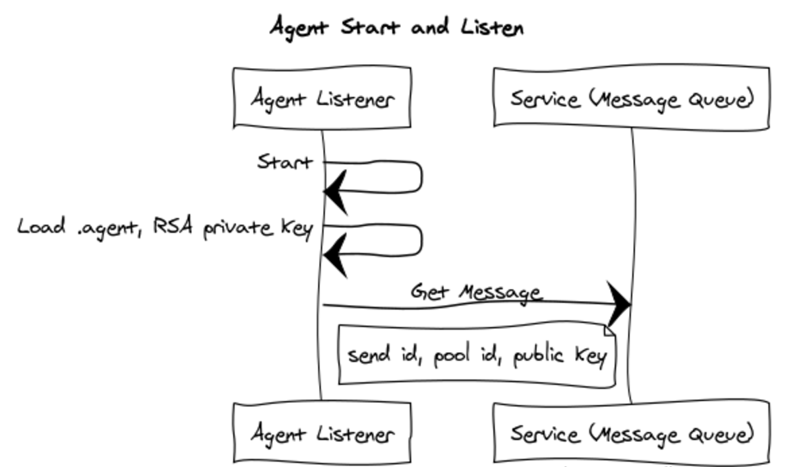
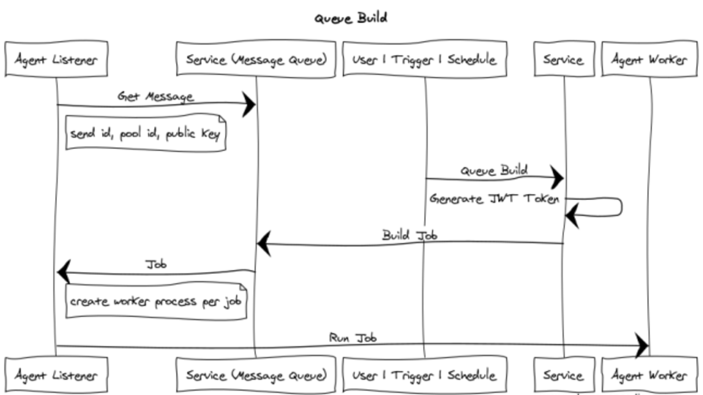

# (DRAFT) Agent Authentication and Authorization

## Goals

  - Support agent from untrusted domains
  - The account that configures the agent and the account the agent runs as, is not relevant for accessing VSTS or TFS resources during a build.
  - Accessing VSTS or TFS resources is done with a per-build token which expires when build completes.
  - The token is granted to trusted parts of the system: the agent, installed tasks and script steps specified by the build admin as trusted.  Protect the token from developer contributions such as unit tests, msbuild targets (not designated as trusted by the build admin). 
  - Same code and scheme for VSTS private agents and TFS on-prem server and agents.

## Configuration

Configuring an agent registers an agent with a pool using your identity.  Configuring an agent is [covered here in the documentation](https://www.visualstudio.com/en-us/docs/build/actions/agents/v2-windows).

Configuration is done with the user being authenticated via a PAT (VSTS | TFS) or optionally for on-prem TFS integrated auth (domain logged on credentials) or NTLM (supply username and password from non domain joined machine - typically Linux or OSX).

*Your credentials are not stored and are only relevant for registering the agent with the service.*

During configuration an RSA private key is created and on windows protected with DPAPI (machine level encrypted - agent only valid on that machine) and on Linux / OSX with chmod permissions.

Using your credentials, the agent is registered with the service by sending the unique clientId and public key to the service which adds that agent to the pool and stores the public key associated with the clientId.

## Start and Listen

After configuring the agent, the agent can be started interactively (./run.cmd or ./run.sh) or as a service.

On start, the agent listener process loads the RSA private key (on windows decrypting with machine key DPAPI), creates a public key and calls the message queue (http long poll) waiting for a job message to run.  The service retrieves the public key it had stored associated with the clientId and validates.

## Queue Build

When a build is queued, it's demands are evaluated, it is matched to an agent and place in an agents queue of messages.  The agent is listening for jobs via the message queue http long poll.

A build is queued manually or as the result of a checkin trigger or build schedule.  A [JWT token](http://self-issued.info/docs/draft-ietf-oauth-json-web-token.html) is generated to for the project or collection level build service account (see options tab of build definition).  The lifetime of the JWT token is the lifetime of the build or at most the build timeout (options tab).

## Accessing VSTS or TFS Resources

The job message sent to the agent contains the token to talk back to VSTS or TFS.  The agent listener parent process will spawn a agent worker process for that build and send the job message over IPC.  The token is never persisted.  

When the worker runs each task it will be sent via an envvar, encrypted, stored in memory and cleared.  The token is registered as a secret and scrubbed from the logs as they are written.

There is an option (checkbox on option tab) to make the token accessible to ad-hoc scripts during the build (powershell, bash, and batch task scripts).

NOTE:  The point is to make the token not *readily* available to developer contributed assets like unit tests and build (msbuild etc..) targets and scripts.  The token is meant for tasks and scripts that are trusted by the build admin by (1) installing the task or (2) directing a build definition to run that script.  The goal is to avoid having the token accidentally leak in scripts.  Even then, the token will expire at the end of the build which helps mitigate any accidental exposure.

## Relevant Planned Work

  - Run tasks in docker image.  Agent runs in host OS, agent and tasks mapped in read only, tasks run in container
  - Composition of Rights.  The ability to designate scopes up to per definition on what resources can be used with the per build token.
