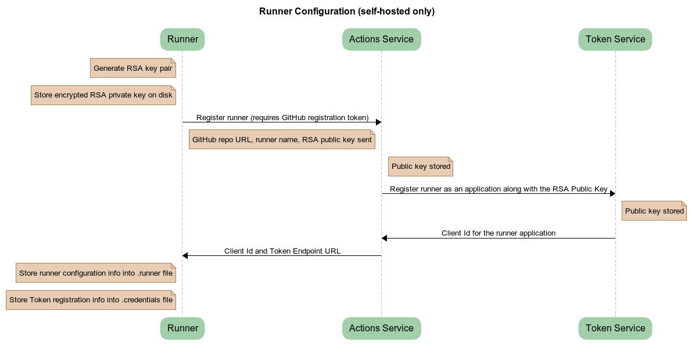
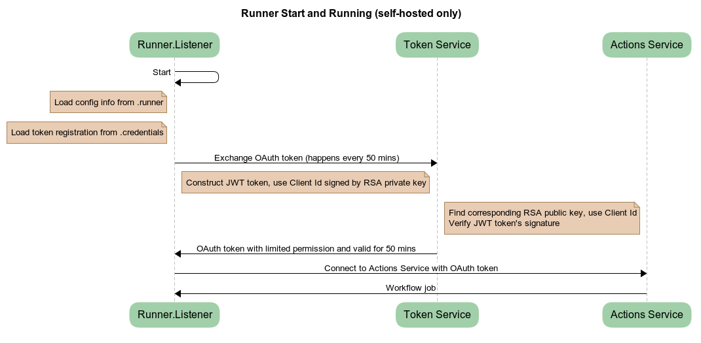
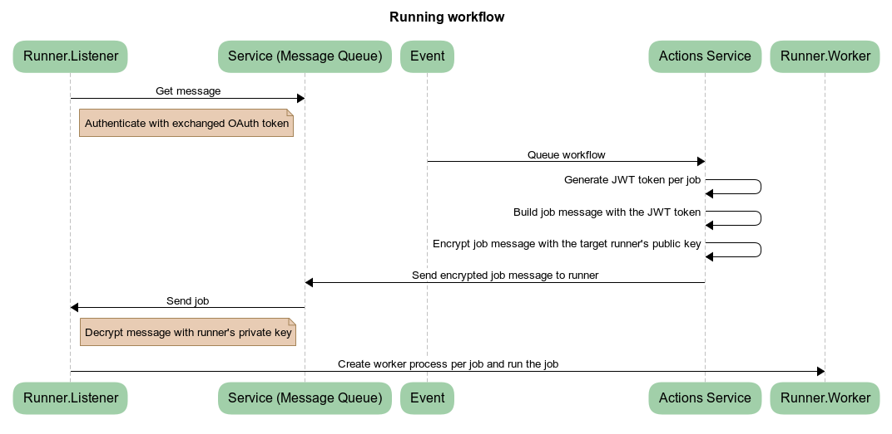
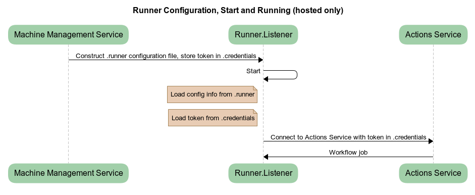

# Runner Authentication and Authorization

## Goals
  - Support runner installs in untrusted domains.
  - The account that configures or runs the runner process is not relevant for accessing GitHub resources.
  - Accessing GitHub resources is done with a per-job token which expires when job completes.
  - The token is granted to trusted parts of the system including the runner, actions and script steps specified by the workflow author as trusted.
  - All OAuth tokens that come from the Token Service that the runner uses to access Actions Service resources are the same. It's just the scope and expiration of the token that may vary.

## Configuration

Configuring a self-hosted runner is [covered here in the documentation](https://help.github.com/en/actions/hosting-your-own-runners/adding-self-hosted-runners).

Configuration is done with the user being authenticated via a time-limited, GitHub runner registration token.

*Your credentials are never used for registering the runner with the service.*

During configuration, an RSA public/private key pair is created, the private key is stored in file on disk. On Windows, the content is protected with DPAPI (machine level encrypted - runner only valid on that machine) and on Linux/OSX with `chmod` permissions.

Using your credentials, the runner is registered with the service by sending the public key to the service which adds that runner to the pool and stores the public key, the Token Service will generate a `clientId` associated with the public key.

## Start and Listen

After configuring the runner, the runner can be started interactively (`./run.cmd` or `./run.sh`) or as a service.

On start, the runner listener process loads the RSA private key (on Windows decrypting with machine key DPAPI), and asks the Token Service for an OAuth token which is signed with the RSA private key.
The server then responds with an OAuth token that grants permission to access the message queue (HTTP long poll), allowing the runner to acquire the messages it will eventually run.

## Run a workflow

When a workflow is run, its labels are evaluated, it is matched to a runner and a message is placed in a queue of messages for that runner.  
The runner then starts listening for jobs via the message queue HTTP long poll.  
The message is encrypted with the runner's public key, stored during runner configuration.  

A workflow is queued as a result of a triggered [event](https://help.github.com/en/actions/reference/events-that-trigger-workflows). Workflows can be scheduled to [run at specific UTC times](https://help.github.com/en/actions/reference/events-that-trigger-workflows#scheduled-events-schedule) using POSIX `cron` syntax.
An [OAuth token](http://self-issued.info/docs/draft-ietf-oauth-json-web-token.html) is generated, granting limited access to the host in Actions Service associated with the github.com repository/organization.
The lifetime of the OAuth token is the lifetime of the run or at most the [job timeout (default: 6 hours)](https://help.github.com/en/actions/reference/workflow-syntax-for-github-actions#jobsjob_idtimeout-minutes), plus 10 additional minutes.

## Accessing GitHub resources

The job message sent to the runner contains the OAuth token to talk back to the Actions Service.
The runner listener parent process will spawn a runner worker process for that job and send it the job message over IPC.
The token is never persisted.

Each action is run as a unique subprocess.
The encrypted access token will be provided as an environment variable in each action subprocess.  
The token is registered with the runner as a secret and scrubbed from the logs as they are written.

Authentication in a workflow run to github.com can be accomplished by using the [`GITHUB_TOKEN`](https://help.github.com/en/actions/configuring-and-managing-workflows/authenticating-with-the-github_token#about-the-github_token-secret)) secret. This token expires after 60 minutes. Please note that this token is different from the OAuth token that the runner uses to talk to the Actions Service.

## Hosted runner authentication

Hosted runner authentication differs from self-hosted authentication in that runners do not undergo a registration process, but instead, the hosted runners get the OAuth token directly by reading the `.credentials` file. The scope of this particular token is limited for a given workflow job execution, and the token is revoked as soon as the job is finished.

