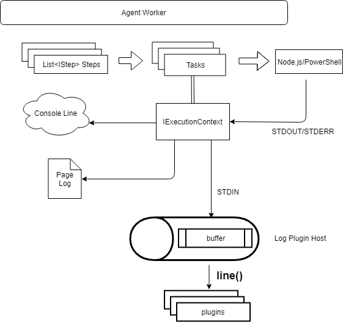

# Agent Log Processors RFC

## Goals

Provide an extensibility mechanism which offers other teams and partners to do additional processing on log output cooperatively as part of the job (as opposed to post job log processing).

Performance and reliability will be critical.  

## Scenarios 

### Publishing Test Results

In addition to our tasks, testing tools can be invoked from command lines. Since many test frameworks do not have reporters by default, we need to scan the output looking for well known output patterns and publish test results to our test management service. We will also search for well known test result file on disk and publish those to our test management service.

These test tools can be called from our tasks but also via command lines and scripts such as `PowerShell`, `ShellScripts`, `python`, `javascript` or any scripting technology.  They can also be called via `npm test` which is simply an indirection to a set of cmd lines and script calls. 

### Telemetry on Tool Usage

It is useful to know the usage and trends of certain scenarios being leverage via Azure Pipelines.  For example, we may want to know the numbers and trends of packages published to `npm` or `nuget`, docker images published or kubernetes configurations applied using our pipelines.

Since we redirect all STDOUT/STDERR, we can identify tool invocation base on each tools output pattern.

Once again, these may be called via tasks, cmd lines, scripts and even runners like `npm run publish`.

### Send Output to Another Service

Output could be processed and sent to another service for storage and processing.  Alternatively, via config, writing back logs to Azure Pipelines can be disabled with the plugin logger offering a message to be substituted.

## Log Processing Plugins

We will introduce a log processing plugins very similar to other agent plugins.

Currently the Worker process will generate an `IList<IStep> steps` base on the job message server send down. Each `IStep` contains an `IExecutionContext`, the execution context is the core component which sends final output message (after mask secrets) to the live console circular buffer and permanent log storage in pages. In addition, `IExecutionContext` will also send the output message to the `log plugin host` through STDIN. 

In a companion out of proc log processing extensibility point, output can be processed in parallel with our log processing.  Since not keeping up with stdin can cause it to fail.  In order to avoid having every plugin to get that right (and to reduce risk), we will create one `log plugin host` which buffers STDIN.

All log plugins are best effort, plugins can't change the result of customer's job.
Plugin can produce outputs back to user, but it can't log error/warning issues back to job.

Plugins will be written in net core and loaded in-proc of the `log plugin host`. It will not block our live console and log publishing.

Each plugin needs to implement the following interface:
```C#
public interface IAgentLogPlugin
{
  // Used for prefix outputs
  string FriendlyName { get;}

  // Invoke on every line of the log output
  Task ProcessLineAsync(IAgentLogPluginContext context, TaskStepDefinitionReference step, string line);
  
  // Invoke after all tasks finished on worker side and all output lines finished process on plugin.
  Task FinalizeAsync(IAgentLogPluginContext context);
}
```

The context will looks like:
```C#
public interface IAgentLogPluginContext
{
  // SystemConnection back to Azure DevOps Service
  public VssConnection VssConnection { get; }

  // Job variables
  public IDictionary<String, VariableValue> Variables { get; }

  // Job endpoints
  public IList<ServiceEndpoint> Endpoints { get; }

  // Job repositories
  public IList<RepositoryResource> Repositories { get; }

  // Tasks that's going to run
  public IDictionary<Guid, TaskStepDefinitionReference> Steps { get; }

  // goes to agent diag log
  void Trace(string message);

  // goes to user's build log in `Job Finalize` node
  void Output(string message);
}
```

General flow looks like:



## Log Processing Host

To ensure log processing plugins do not block stdin, the host will take care of buffering output, processing that buffer or queue of log lines and processing that queue.  That buffering may start out as in memory similar to our other queues but we could consider backing it by files if required.

As it's processed each plugin will be called with `ProcessLineAsync(AgentLogPluginContext context, TaskStepDefinitionReference step, string line)`.  That will be a blocking call per plugin which would ideally do light processing or alter internal tracking state and return.

If a plugin writes transient state data, it should do it in the agent temp folder so it gets cleaned up automatically by the agent.  To encourage this, the host plugin will provide context that contains all job variables worker setup at the beginning of the build, so plugin can get the temp folder base on `$(Agent.TempDirectory)`.

It is a requirement that plugins process output in a stream SAX style processing style.  Buffering the full log and then processing will not be efficient and may get you flagged in telemetry or terminated by the plugin host.

Each plugin will prefer a friendly user message on it's role used in user feedback (see below).

The processing host will also have deep tracing in agent diagnostics.

## Lifetime

Worker will start the log processing plugin host at the end of `Job Initialize` along with a `LogPluginHostContext` send through STDIN in JSON format.


```C#
public class LogPluginHostContext
{
  // Job variables
  public IDictionary<String, VariableValue> Variables { get; }

  // Job endpoints
  public IList<ServiceEndpoint> Endpoints { get; }

  // Job repositories
  public IList<RepositoryResource> Repositories { get; }

  // Tasks that's going to run
  public IDictionary<Guid, TaskStepDefinitionReference> Steps { get; }
}
```

After plugin host started, the plugin host will start async plugin process task for each plugin in separate threads. Then, the plugin host will sit in a loop of reading STDIN and redirect the input to each plugin.

When worker finish running all job steps (tasks defined by user in their definition), the worker will enter `Job Finalize` mode. Worker will send a special string `##vso[logPlugin.finish]` to the plugin host, so each plugin can start their finalize process. The worker will start stream output from plugin host to user, so user can figure out what's going on.

```C#

AgentLogPluginHost pluginHost = new AgentLogPluginHost(context, plugins);
Task pluginHostTask = pluginHost.Run();
while(true)
{
  var input = Console.ReadLine();
  if(string.Equals(input, "##vso[loglugin.finish]"))
  {
    pluginHost.Finish();
    break;
  }
  else
  {
    pluginHost.EnqueueConsoleOutput(input);
  }
}

await pluginHostTask;
```

## Circuit Breaking

The worker will monitor the log host process.  If it crashes or returns a non success code, report the error to log.  

The agent and worker should continue reliably in the even of any issues with side processing.

The plugin host will short-circuit the plugin if the plugin is not able to catch up processing outputs.

For now, we will circuit break on memory usage, if the plugin has more than 10MB pending strings for more than 100 sec, we will stop let that plugin process anymore.

## Telemetry (TODO)

We need telemetry on:  

  - Disabling log hosts
  - Failure to load a plugin: it will be disabled
  - Memory usage of the out of proc log host processor (plugins are in proc to that)
  - Add more here

## Testing  

Since this work has the potential to be impactful on performance and reliability we will do heavy L0 testing around both the positive cases and the negative scenarios (getting circuit breaks etc...).  In the negative case testing, we can simply set the thresholds extremely low.  For example, set memory consumption or processor utilization very low to avoid taking down the box running the tests.  We are testing the circuit breaking functionality.

Each plugin should be heavily tested in L0 fashion by contributing a set of output files and baseline results.  The tests will feed the output test files into the log processing host with the plugin writing it's conclusions to an output file that we baseline and automate.

## Scope and Delivery

Initially this will be first party plugins packaged with the agent.  Eventually, this may be opened to external third party plugins.  Achieving that would require service side features to deliver as an extension.  It would also introduce another compatibility issue moving independently of the agent.

If we expose externally (not delivered as part of the agent), we will offer the ability to be your own log processing host because of the compat and dependency problems (agents stay back and get auto updated).  This is a long discussion out of the scope of this design document.


## Sample

A sample log plugin implementation might looks like following:

```C#
using System;
using System.Collections.Generic;
using System.Threading.Tasks;
using Agent.Sdk;
using Pipelines = Microsoft.TeamFoundation.DistributedTask.Pipelines;
using Microsoft.VisualStudio.Services.Agent.Util;
using System.IO;
using Microsoft.VisualStudio.Services.Common;

namespace Agent.Plugins.Log
{
    public class SampleLogPlugin : IAgentLogPlugin
    {
        public string FriendlyName => "Re-save Log";

        private string _fileName = $"{Guid.NewGuid().ToString("N")}.log";

        public Task<bool> InitializeAsync(IAgentLogPluginContext context)
        {
            return Task.FromResult(true);
        }

        public Task ProcessLineAsync(IAgentLogPluginContext context, Pipelines.TaskStepDefinitionReference step, string output)
        {
            context.Trace("DEBUG_PROCESS");
            var file = Path.Combine(context.Variables.GetValueOrDefault("agent.homedirectory").Value, "_diag", _fileName);
            context.Output($"{step.Name}: {output}");
            return Task.CompletedTask;
        }

        public async Task FinalizeAsync(IAgentLogPluginContext context)
        {
            context.Trace("DEBUG_FINISH");
            var file = Path.Combine(context.Variables.GetValueOrDefault("agent.homedirectory").Value, "_diag", _fileName);
            await File.AppendAllTextAsync(file, StringUtil.ConvertToJson(context.Variables));
        }
    }
}

```