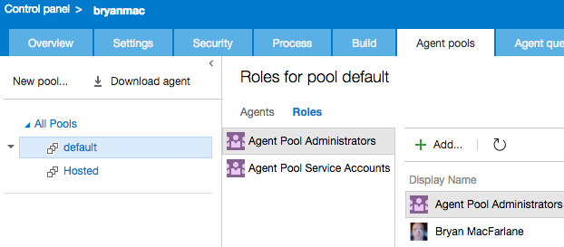

# Configure Account and Roles

## VSTS

Create a PAT token.  [Step by Step here](http://roadtoalm.com/2015/07/22/using-personal-access-tokens-to-access-visual-studio-online/)

## On Premises TFS

You can use a domain user but it's recommended to create a local windows user on each of your application tiers specifically for registering build agents.

## Add to Role

Add the user from above to only the Agent Pool Administrators which allows you to register the agent.

>> TIPS:
>> You can add to roles for a specific pool or select "All Pools" on the left and grant for all pools.  This allows the account owner to delegate build administration globally or for specific pools.  [More here](https://msdn.microsoft.com/en-us/Library/vs/alm/Build/agents/admin)
>> The role is only needed to register the agent.  A token is downloaded to listen to the queue.
>> When a build is run, it will generate an OAuth token for the scoped identity selected on the general tab of the build definition.  That token is short lived and will be used to access resource in VSTS.  The account used to register the agent has no bearing on the build run time credentials